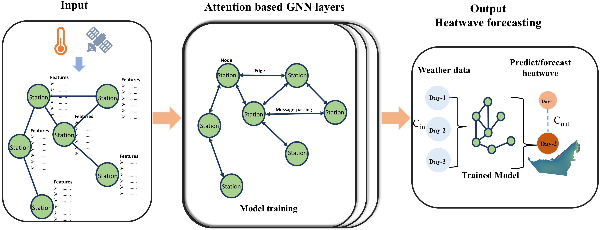
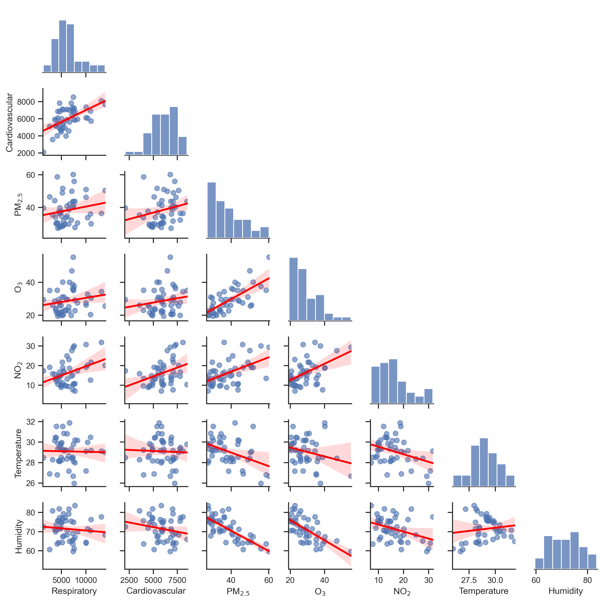
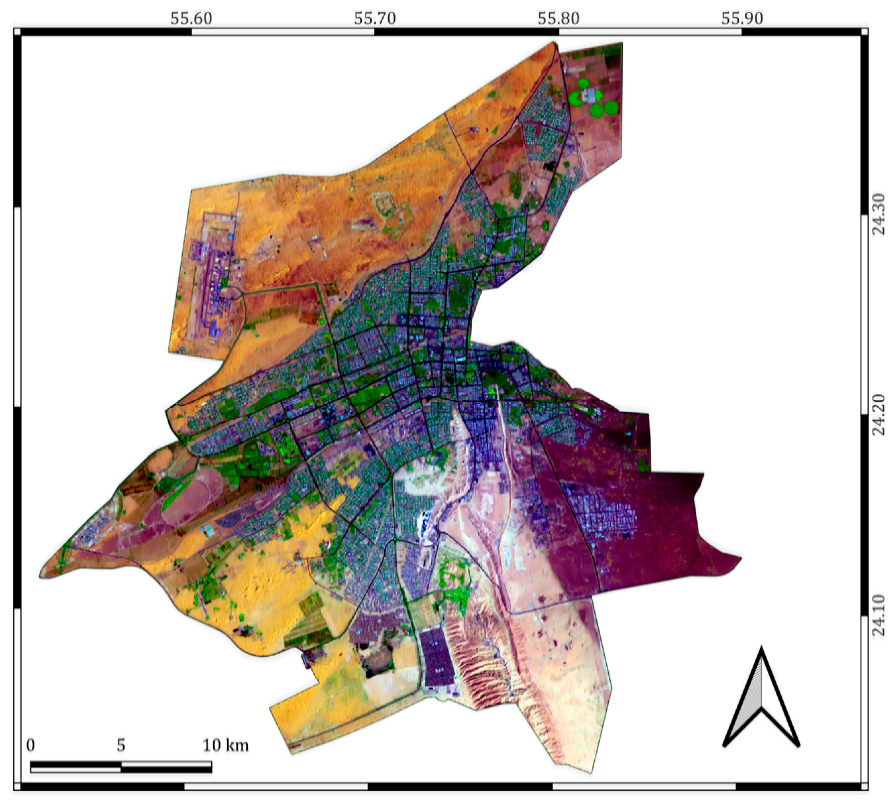
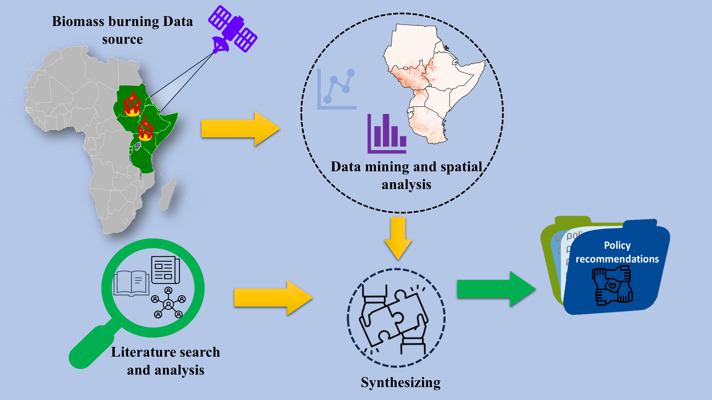
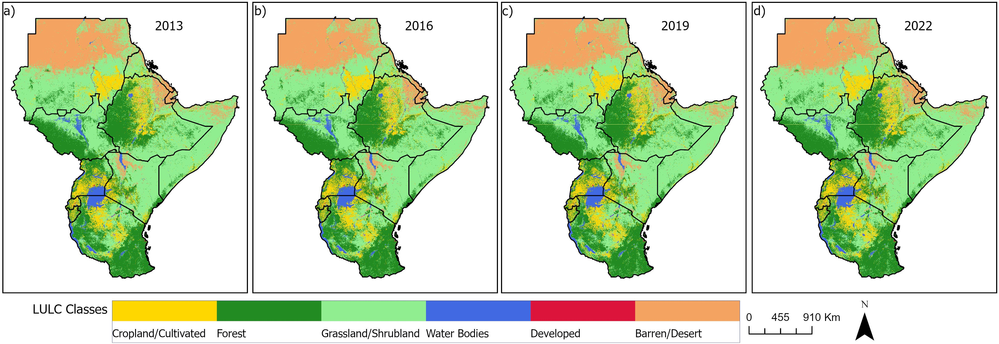
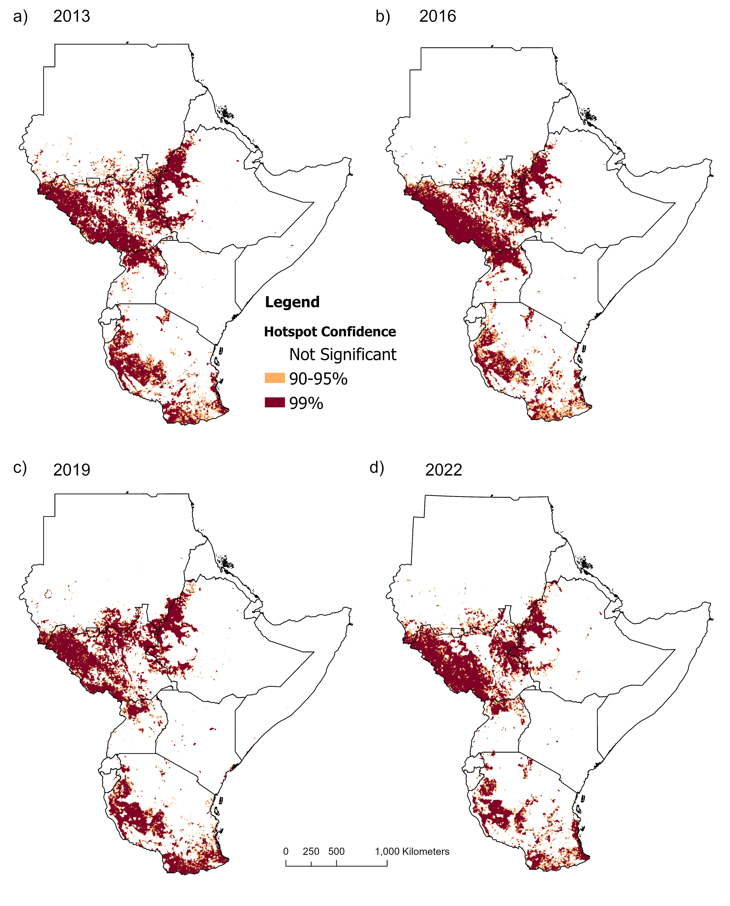
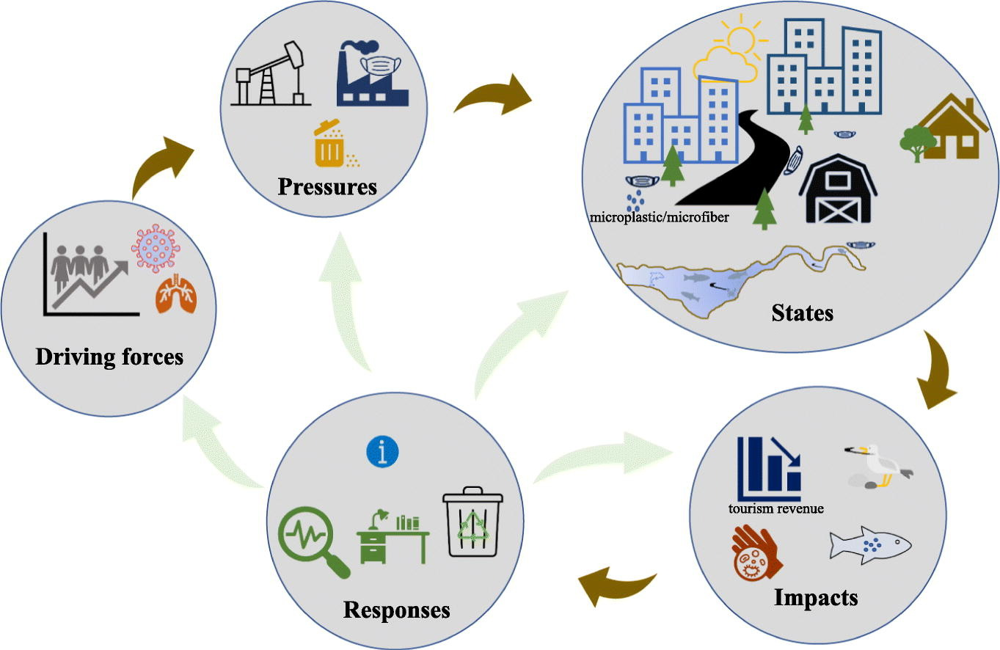

# Yacob T. Tesfaldet

## Background

Dr. Yacob T. Tesfaldet is an environmental data scientist with 7+ years of experience spanning academia and applied research. He specializes in geospatial data science, GeoAI, and computer vision. He combines GIS, remote sensing, and spatiotemporal modeling to track environmental changes, and climate risks for public health, urban sustainability, and policy impact. He also serves as a Scientific Editor for Elsevier's *Next Research* journal.

**Research Interests:** Geospatial Data Science · Remote Sensing & GIS · GeoAI & Explainable AI · Climate Change · Spatiotemporal Environmental & Health Modelling

**Skills:** Python · ArcGIS Pro/Online · QGIS · Google Earth Engine · Git & GitHub

---

## Projects

### [Graph Neural Networks for Heatwave Early Warning in Arid Regions](https://doi.org/10.1016/j.uclim.2026.102910)

Built a graph neural network for short-term heatwave forecasting in the data-sparse UAE, improving early-warning lead time for climate-health risk. *(2025–Present, Emirates Aviation University)*

### [AI-Powered Ethiopian Wolf Habitat Monitoring](https://doi.org/10.1007/s41748-026-01066-x)

Applied machine learning to satellite imagery to detect land encroachment threatening Ethiopian wolf habitat in Bale Mountains National Park. *(2024–2025, Connected Conservation Foundation & Airbus Foundation — Principal Investigator)*

### [Probabilistic Health Risk Assessment of Urban Air Pollution in Bangkok](https://doi.org/10.1080/09603123.2025.2508891)

Quantified respiratory and cardiovascular risk from ambient PM2.5 in Bangkok using scenario-based probabilistic modelling, informing air-quality policy. *(2020–2024, Chulalongkorn University — Principal Investigator)*

### [Mapping Urban Quality of Life from Satellite Imagery](https://doi.org/10.3390/ijgi11090458)

Combined remote sensing and machine learning to extract urban quality-of-life indicators and estimate population density in Al Ain, UAE. *(2022–2023, UAE University)*

### [Flood-Hazard Mapping and Oasis Preservation in Al Ain](https://doi.org/10.3390/w16172408)

Integrated building-age classification with flood-hazard mapping and land-use change analysis (1972–2022) to guide conservation of Al Ain's historical oases. *(2022–2023, UAE University)*

### [Mapping Open Biomass Burning Practices in East Africa](https://doi.org/10.1016/j.gloplacha.2026.105358)
 &nbsp;&nbsp;&nbsp; 

Used data-mining on a decade of satellite fire data (2013–2022) to uncover open biomass-burning patterns across East Africa for evidence-based policy. *(2026, collaborative research)*

### [Face Masks in the Environment: Risk and Policy Implications](https://doi.org/10.1016/j.scitotenv.2021.152859)

Assessed the environmental fate and public-health trade-offs of face-mask waste during COVID-19 using the DPSIR policy framework. *(2021–2023, Chulalongkorn University — Principal Investigator)*

---

## Find Me
[LinkedIn](https://www.linkedin.com/in/yacob-t-tesfaldet-929521151/) · [Google Scholar](https://scholar.google.co.th/citations?user=HSXZDDkAAAAJ&hl=en) · [ORCID](https://orcid.org/0000-0002-3763-6913) · [GitHub](https://github.com/jacobins3)
